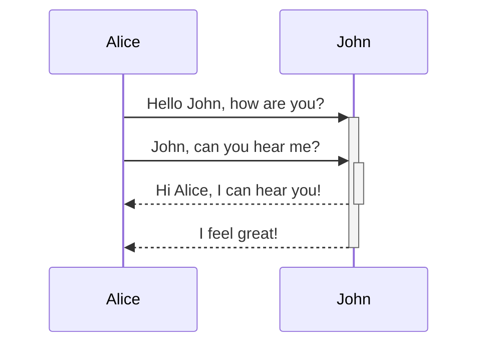

```
<iframe src="" width="1200" height="600" frameborder="0" ></iframe>
```

---

<!-- slide template="[[tpl-datadog-basic-light]]" -->

::: block 
This is in a block
:::

```js [1-2|3|4]
let a = 1;
let b = 2;
let c = x => 1 + 2 + x;
c(3);
```

Here's a footnote[^1]

[^1]: meaningful!

<style>
.h1 {
color: #632CA6;
}
</style>

---

::: block
#### Header
_and_
Paragraph content
*in same block*

:::

---

no color

::: block <!-- element style="background-color: red;" -->

everything inside this block has red background color

::: block <!-- element style="background-color: blue;" -->

blue

:::

red

:::

no color

---

```chart
    type: bar
    labels: [Monday,Tuesday,Wednesday,Thursday,Friday, Saturday, Sunday, "next Week", "next Month"]
    series:
      - title: Title 1
        data: [1,2,3,4,5,6,7,8,9]
      - title: Title 2
        data: [5,4,3,2,1,0,-1,-2,-3]
    ```

````

---




---

First Header | Second Header
------------ | ------------
Content from cell 1 | Content from cell 2
Content in the first column | Content in the second column
