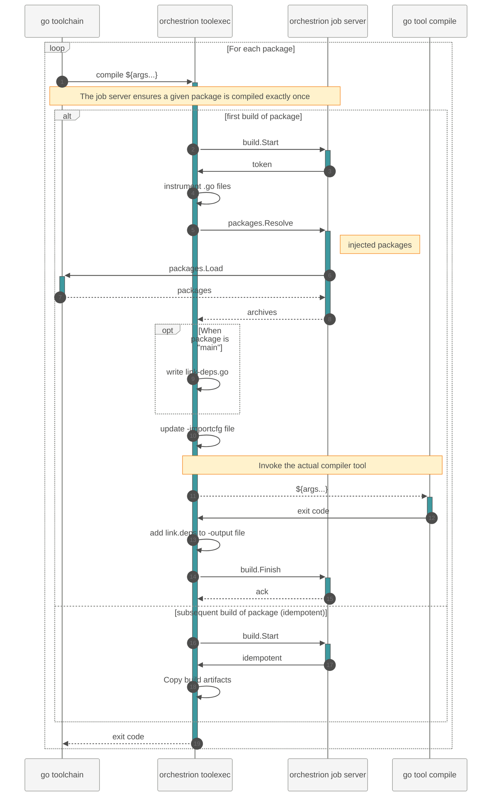
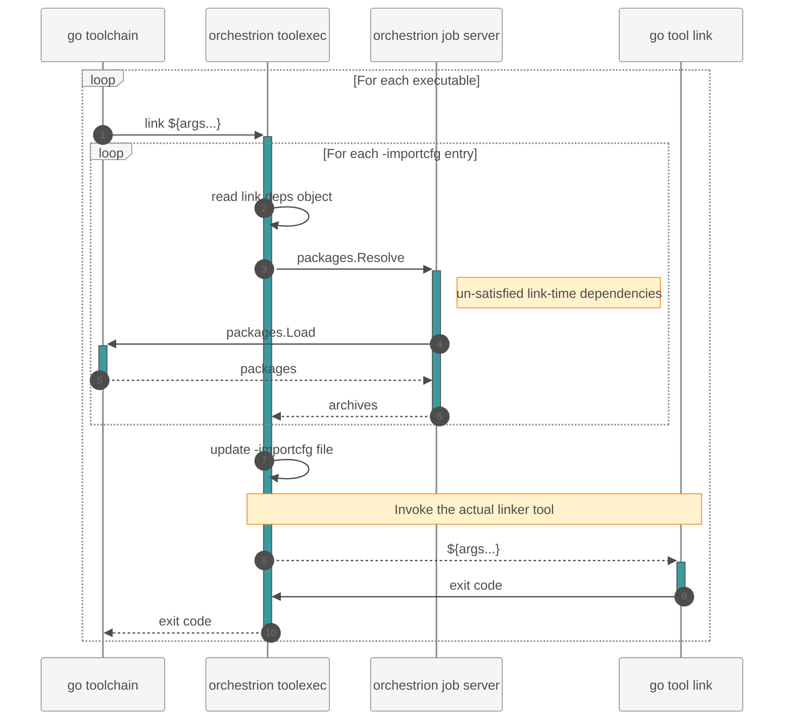

<!-- slide template="[[tpl-datadog-basic-light]]" -->
# `Unleashing the Go Toolchain`
::: block
#### `GopherCon UK '25`
`Kemal Akkoyun | @kakkoyun`
:::

---

<!-- slide template="[[tpl-datadog-basic-light]]" -->

# `$whoami`

notes:

- A software engineer at Datadog working on APM and observability
- A father, husband, and a dog owner (she passed away last year)
- I'm a geek, a nerd (D&D, Custom keyboards, rasperry pi cluster, etc.)
- Recently, I'm into personal knowledge management
- Experience in **performance engineering** and **observability**.
- Focus on **instrumenting applications** for **continuous profiling** and **runtime insights**.
- Proficient in **memory management**, **concurrency**, and **runtime internals**, especially in **Go**.

- **Maintainership**:  
  - [**Prometheus**](https://prometheus.io), [**Thanos**](https://thanos.io), [**Prometheus Operator**](https://github.com/prometheus-operator/prometheus-operator), and [**Parca**](https://parca.dev) team member.  
  - One of the maintainers of the [**Prometheus Go Client Library (client_golang)**](https://github.com/prometheus/client_golang).
- Built **eBPF-based whole-system performance profiler**: [parca-agent](https://github.com/parca-dev/parca-agent).  
- Contributor to foundational **observability tools** under CNCF.

- A member in **OpenTelemetry Profiling** and **OpenTelemetry Go Compilte-time Instrumentation** SIG and projects.
	- *Past:* **CNCF TAG Observability**, and **Kubernetes SIG Instrumentation**

---

<!-- slide bg="#632CA6" -->

![[dd_logo_v_white.png|400]]

notes:
- I work at datadog on APM. We want folks to be able to catch logs/metrics/traces in their code to know what’s up in their code.
- Datadog serves over 30,000 customers including 8 of the top 10 leading AI companies
- We monitor billions of containers per day and collect over a hundred trillion events per day
- Our engineering org has over 2,500 people - and we're always hiring great Go developers!
- Our team is one the most prolific contributors to the Go runtime and toolchain outside of Google

- Do you know this mascot has a name? It's called `Bits`. You know Datadog, bits?? 🤣
- Pun intended. There are a lot of dog puns internally. Pun dog meme is real!

---

<!-- slide template="[[tpl-datadog-basic-light]]" -->

# `What makes Go great?`

notes:

I know everyone here is passionate about Go—that’s why we’re all at GopherCon! So instead of searching for a unique answer, I’ll just share what makes Go great to me.

---

<!-- slide template="[[tpl-datadog-basic-light]]" -->

# Simplicity

---

<!-- slide template="[[tpl-datadog-basic-light]]" -->

![[abelson_quote.png]]

notes:

Why is it so important that Go is easy to read? It's because when we write code, we are primarily writing it so that someone else can understand it later. As Hal Abelson, the legendary CS professor from MIT said, “programs must be written for people to read, and only incidentally for machines to execute”.

---

<!-- slide template="[[tpl-datadog-basic-light]]" -->

+ Simple to understand.
+ Simple to troubleshoot.
+ Simple to operate.

notes:

For me, it is simplicity.

- Code is easy to read
- No hidden complexity
- Clear function call chains
- No method/function/operator overloading
- What you see is what you get
- Native binary

Very closely related to Go's readability is that Go code doesn't hide things. It's pretty easy to figure out what function is invoked by what function in what order. That's one of the reasons why there's no method, function, or operator overloading.

The code is easy to read

When you read the code, there's nothing hidden, you can see everything that executes

And when you compile, you get a native binary with no dependencies

---

<!-- slide template="[[tpl-datadog-basic-light]]" -->

*No magic*

![[no_magic.png|300]]

notes:

It's a non-magical language. 

What do I mean by non-magical?

notes:

Magic in programs often seems like a great idea while you are working on it,
but when you go back to the code later or have to debug a problem,
it's always ten times harder to figure out what's going on and what went wrong.

And these three things are pretty great, they've helped me avoid a lot of pain whenever I'm working in Go.

---

<!-- slide template="[[tpl-datadog-basic-light]]" -->

# `Why This Matters?`

*Magic seems great while coding...* <!-- element class="fragment" -->

*...but debugging the magical code is 10x harder* <!-- element class="fragment" -->

notes:

I used to be a Ruby on Rails developer. I've seen the magic of Rails.
It's a great framework. It's a great language. It's a great community.
It's a great ecosystem. It's a great tool. It's a great everything.

But, and yeah, there's always a but, when you have to debug a problem,
it's always ten times harder to figure out what's going on and what went wrong.

Hence I evolved into a Go developer.

---


<!-- slide template="[[tpl-datadog-basic]]" -->

# `There's always a "but"...` <!-- element class="fragment" -->

notes:

But, and yeah, there's always a but, there are some downsides to the things that make Go great.

Before I go into those downsides, let's change topics for a moment. Let's talk about distributed tracing and observability. I promise this will all make sense in a couple of minutes.


---

<!-- slide template="[[tpl-datadog-basic-light]]" -->

## The Three Pillars of Observability

notes:

Let's talk about observability, for a moment.

---

<!-- slide template="[[tpl-datadog-basic-light]]" -->

| Pillar | Purpose |
|--------|---------|
| **Logs** | What happened? |
| **Metrics** | How much and how fast? |
| **Traces** | Where did the time go? (fancy logs) |

notes:

For observability to work, we need these three pillars working together.
But the challenge is how to collect this data without making developers' lives miserable.

---

<!-- slide template="[[tpl-datadog-basic-light]]" -->

# `The Manual Way`

Let's see how manual instrumentation looks... <!-- element class="fragment" -->

---

<!-- slide template="[[tpl-datadog-basic-light]]" -->

::: title
## Manual Instrumentation
:::

**Go 🐹 - Setup (Simplified)**

```go [1-3|5-8|10-12|14-15]
var tracer trace.Tracer

func main() {
    ctx := context.Background()
    exp, _ := newExporter(ctx)

    // Create tracer provider with batch span processor
    tp := newTraceProvider(exp)
    defer func() { _ = tp.Shutdown(ctx) }()

    otel.SetTracerProvider(tp)

    // Finally, set the tracer
    tracer = tp.Tracer("ExampleService")
}
```

notes:

In Go, first you need this setup code in every service. This is just the initialization - we haven't even started tracing actual functions yet.

---

<!-- slide template="[[tpl-datadog-basic]]" -->

::: title
## Manual Instrumentation
:::

---

<!-- slide template="[[tpl-datadog-basic]]" -->

## Go 🐹 - Setup (Realistic)

```go
package main

import (
	"context"
	"errors"
	"time"

	"go.opentelemetry.io/otel"
	"go.opentelemetry.io/otel/exporters/stdout/stdoutlog"
	"go.opentelemetry.io/otel/exporters/stdout/stdoutmetric"
	"go.opentelemetry.io/otel/exporters/stdout/stdouttrace"
	"go.opentelemetry.io/otel/log/global"
	"go.opentelemetry.io/otel/propagation"
	"go.opentelemetry.io/otel/sdk/log"
	"go.opentelemetry.io/otel/sdk/metric"
	"go.opentelemetry.io/otel/sdk/trace"
)

// setupOTelSDK bootstraps the OpenTelemetry pipeline.
// If it does not return an error, make sure to call shutdown for proper cleanup.
func setupOTelSDK(ctx context.Context) (shutdown func(context.Context) error, err error) {
	var shutdownFuncs []func(context.Context) error

	// shutdown calls cleanup functions registered via shutdownFuncs.
	// The errors from the calls are joined.
	// Each registered cleanup will be invoked once.
	shutdown = func(ctx context.Context) error {
		var err error
		for _, fn := range shutdownFuncs {
			err = errors.Join(err, fn(ctx))
		}
		shutdownFuncs = nil
		return err
	}

	// handleErr calls shutdown for cleanup and makes sure that all errors are returned.
	handleErr := func(inErr error) {
		err = errors.Join(inErr, shutdown(ctx))
	}

	// Set up propagator.
	prop := newPropagator()
	otel.SetTextMapPropagator(prop)

	// Set up trace provider.
	tracerProvider, err := newTracerProvider()
	if err != nil {
		handleErr(err)
		return
	}
	shutdownFuncs = append(shutdownFuncs, tracerProvider.Shutdown)
	otel.SetTracerProvider(tracerProvider)

	// Set up meter provider.
	meterProvider, err := newMeterProvider()
	if err != nil {
		handleErr(err)
		return
	}
	shutdownFuncs = append(shutdownFuncs, meterProvider.Shutdown)
	otel.SetMeterProvider(meterProvider)

	// Set up logger provider.
	loggerProvider, err := newLoggerProvider()
	if err != nil {
		handleErr(err)
		return
	}
	shutdownFuncs = append(shutdownFuncs, loggerProvider.Shutdown)
	global.SetLoggerProvider(loggerProvider)

	return
}

func newPropagator() propagation.TextMapPropagator {
	return propagation.NewCompositeTextMapPropagator(
		propagation.TraceContext{},
		propagation.Baggage{},
	)
}

func newTracerProvider() (*trace.TracerProvider, error) {
	traceExporter, err := stdouttrace.New(
		stdouttrace.WithPrettyPrint())
	if err != nil {
		return nil, err
	}

	tracerProvider := trace.NewTracerProvider(
		trace.WithBatcher(traceExporter,
			// Default is 5s. Set to 1s for demonstrative purposes.
			trace.WithBatchTimeout(time.Second)),
	)
	return tracerProvider, nil
}

func newMeterProvider() (*metric.MeterProvider, error) {
	metricExporter, err := stdoutmetric.New()
	if err != nil {
		return nil, err
	}

	meterProvider := metric.NewMeterProvider(
		metric.WithReader(metric.NewPeriodicReader(metricExporter,
			// Default is 1m. Set to 3s for demonstrative purposes.
			metric.WithInterval(3*time.Second))),
	)
	return meterProvider, nil
}

func newLoggerProvider() (*log.LoggerProvider, error) {
	logExporter, err := stdoutlog.New()
	if err != nil {
		return nil, err
	}

	loggerProvider := log.NewLoggerProvider(
		log.WithProcessor(log.NewBatchProcessor(logExporter)),
	)
	return loggerProvider, nil
}
```

---

<!-- slide template="[[tpl-datadog-basic-light]]" -->

::: title
## Manual Instrumentation
:::

**Go 🐹  - Every function:**

```go
func httpHandler(w http.ResponseWriter, r *http.Request) {
    ctx, span := tracer.Start(r.Context(), "my_span")
    defer span.End()

    // YOUR BUSINESS LOGIC GOES HERE
}
```

notes:

Then, for every single function you want to trace, you need to add these two lines. Multiply this by hundreds of functions in a real service, and you can see the problem.


---

<!-- slide template="[[tpl-datadog-basic]]" -->

::: title
Manual Instrumentation
:::

## Python 🐍

```python [1-3|5-7|14-16]
from opentelemetry import trace
from opentelemetry.trace import Status, StatusCode

def process_order(order_id):
    tracer = trace.get_tracer(__name__)
    with tracer.start_as_current_span("process-order") as span:
        span.set_attribute("order.id", order_id)

        try:
            # Your business logic here
            validate_order(order_id)
            charge_payment(order_id)
            ship_order(order_id)
        except Exception as e:
            span.record_exception(e)
            span.set_status(Status(StatusCode.ERROR, str(e)))
            raise
        else:
            span.set_status(Status(StatusCode.OK))
```

---

<!-- slide template="[[tpl-datadog-basic]]" -->


::: title
Manual Instrumentation
:::

## Go 🐹

```go [7-9|11|14-15]
import (
    "go.opentelemetry.io/otel"
    "go.opentelemetry.io/otel/attribute"
)

func processOrder(ctx context.Context, orderID string) error {
    tracer := otel.Tracer("order-service")
    ctx, span := tracer.Start(ctx, "process-order")
    defer span.End()

    span.SetAttributes(attribute.String("order.id", orderID))

    if err := validateOrder(ctx, orderID); err != nil {
        span.RecordError(err)
        span.SetStatus(codes.Error, err.Error())
        return err
    }

    if err := chargePayment(ctx, orderID); err != nil {
        span.RecordError(err)
        span.SetStatus(codes.Error, err.Error())
        return err
    }

    return shipOrder(ctx, orderID)
}
```

---

<!-- slide template="[[tpl-datadog-basic-light]]" -->

# `The Semi-Automatic Way`

Annotations and decorators... <!-- element class="fragment" -->

---

<!-- slide template="[[tpl-datadog-basic]]" -->


::: title
Semi-Automatic Instrumentation
:::

## Python 🐍

```python [1-2|4]
# This could exist but doesn't in OpenTelemetry AFAIK
from hypothetical_otel import trace

@trace.instrument("process-order")
def process_order(order_id: str):
    validate_order(order_id)
    charge_payment(order_id)
    ship_order(order_id)
```

---

<!-- slide template="[[tpl-datadog-basic]]" -->


::: title
Semi-Automatic Instrumentation
:::

## Java ☕

```java [5-6]
import io.opentelemetry.instrumentation.annotations.WithSpan;
import io.opentelemetry.instrumentation.annotations.SpanAttribute;

public class OrderService {
    @WithSpan("process-order")
    public void processOrder(@SpanAttribute("order.id") String orderId) {
        // Clean business logic
        validateOrder(orderId);
        chargePayment(orderId);
        shipOrder(orderId);
    }
}
```

---

<!-- slide template="[[tpl-datadog-basic]]" -->

::: title
Semi-Automatic Instrumentation
:::

## Go 🐹

```go
// No annotation support in Go!
// 🎉 YAY! Simplicity! 🌮
func processOrder(ctx context.Context, orderID string) error {
    ctx, span := tracer.Start(ctx, "process-order")
    defer span.End()

    span.SetAttributes(attribute.String("order.id", orderID))
    // ... error handling boilerplate ...
}

// Every. Single. Function. 😭
```

---

<!-- slide template="[[tpl-datadog-basic-light]]" -->

# `The Fully Automatic Way`

Zero code changes required... <!-- element class="fragment" -->

---

<!-- slide template="[[tpl-datadog-basic]]" -->

::: title
Fully Automatic Instrumentation
:::

## Python 🐍

```shell [2-3|6]
# Install and bootstrap
pip install opentelemetry-distro opentelemetry-exporter-otlp
opentelemetry-bootstrap -a install

# Run with zero code changes
opentelemetry-instrument python myapp.py
```

<div>

**Works automatically with:** Flask, Django, FastAPI, requests, psycopg2, redis...

</div><!-- element class="fragment" -->

---

<!-- slide template="[[tpl-datadog-basic]]" -->

::: title
Fully Automatic Instrumentation
:::

## Java ☕

```shell [2|5]
# Download the agent
curl -L -o agent.jar https://github.com/.../opentelemetry-javaagent.jar

# Run with zero code changes
java -javaagent:agent.jar -jar myapp.jar
```

<div>

**Works automatically with:** Spring, Servlet, JDBC, HTTP clients, Kafka...

</div><!-- element class="fragment" -->

---

<!-- slide template="[[tpl-datadog-basic]]" -->

::: title
Fully Automatic Instrumentation
:::

## Go 🐹 - Still Manual...

```go
// 🎉 YAY! Simplicity! 🌮
func processOrder(ctx context.Context, orderID string) error {
    ctx, span := tracer.Start(ctx, "process-order")
    defer span.End()

    span.SetAttributes(attribute.String("order.id", orderID))
    // ... error handling boilerplate ...
}
```

**No agent. No magic. Just ~~pain~~ boilerplate.** <!-- element class="fragment" -->

---

<!-- slide template="[[tpl-datadog-basic-light]]" -->

# `The Reality Check`

The developer experience gap is real... <!-- element class="fragment" -->

---

<!-- slide template="[[tpl-datadog-basic-light]]" -->

# The Pain is Real

---

<!-- slide template="[[tpl-datadog-basic-light]]" -->

**Manual instrumentation means**

| | Challenge |
|---|---|
| ❌ | Writing boilerplate in every function |
| ❌ | Remembering to add spans for new code |
| ❌ | Inconsistent coverage across teams |
| ❌ | Maintenance burden when requirements change |

---
<!-- slide template="[[tpl-datadog-basic-light]]" -->

**What Go developers want:**

> "The same zero-friction experience other languages have..."

| | Goal |
|---|---|
| ✅ | Automatic instrumentation |
| ✅ | No runtime performance overhead |
| ✅ | No manual code changes |

---

<!-- slide template="[[tpl-datadog-basic-light]]" -->

# `The Question`

**How can Go compete with runtime magic?** <!-- element class="fragment" -->

notes:

This is the key question. Go doesn't have annotations, runtime bytecode manipulation, or monkey patching. So how can it possibly compete with languages that do?

---

<!-- slide template="[[tpl-datadog-basic]]" -->

## The Challenge

---

<!-- slide template="[[tpl-datadog-basic-light]]" -->

**Go's constraints:**

| Constraint | Why It Matters |
|------------|----------------|
| ❌ No annotations | Can't use `@WithSpan` |
| ❌ No runtime code injection | Can't modify behavior at runtime |
| ✅ Must compile instrumentation | Everything baked into binary |

notes:

Go has some fundamental constraints that make traditional automatic instrumentation approaches impossible. But there's a key insight here - Go's philosophy has always been to put the magic in the build tools, not in the runtime.

---

<!-- slide template="[[tpl-datadog-basic-light]]" -->

# `The Solution?`

**Go has a hidden superpower...** <!-- element class="fragment" -->
**The toolchain is just another Go program** <!-- element class="fragment" -->

---

<!-- slide template="[[tpl-datadog-basic-light]]" -->

## `Go Puts its Magic in Tools, not the Language`

---

<!-- slide template="[[tpl-datadog-basic-light]]" -->

## Show of Hands 🙋

**Who has ever heard about `toolexec`?**

notes:

Before we dive deeper, let's see where everyone stands. This will help me gauge how deep to go into certain topics.

Now that we understand the why and the how, let's get practical. I'm going to show you exactly how to build a toolexec wrapper that can automatically instrument Go code. We'll start simple and build up to production-ready solutions.

---


<!-- slide template="[[tpl-datadog-basic-light]]" -->

## Introducing: `-toolexec`

**Go's best kept secret** <!-- element class="fragment" -->

```bash [1|3-4]
go help build | grep -A6 toolexec

-toolexec 'cmd args'
 a program to use to invoke toolchain programs like vet and asm.
 For example, instead of running asm, the go command will run
 'cmd args /path/to/asm <arguments for asm>'.
 The TOOLEXEC_IMPORTPATH environment variable will be set,
 matching 'go list -f {{.ImportPath}}' for the package being built.
```

notes:

Let's look at what toolexec actually is. According to the Go documentation, toolexec lets you specify a program to invoke toolchain programs. So instead of running the compiler directly, Go will run your wrapper program with the compiler as an argument.

---

<!-- slide template="[[tpl-datadog-basic-light]]" -->

## With `-toolexec`, We Intercept Everything

---

<!-- slide template="[[tpl-datadog-basic-light]]" -->

## Simple Wrapper

**First, let's just intercept the build process**

notes:

Let's start by building the simplest possible toolexec wrapper. This will help us understand how the toolchain calls tools and what information we have access to.

---

<!-- slide template="[[tpl-datadog-basic-light]]" -->

### The Basic Wrapper

```go [11-15|17-20|22-26|28-32]
package main

import (
	"fmt"
	"os"
	"os/exec"
	"strings"
	"time"
)

func main() {
	if len(os.Args) < 2 {
		fmt.Fprintf(os.Stderr, "TOOLEXEC: error: no tool specified\n")
		os.Exit(1)
	}

	tool := os.Args[1]
	args := os.Args[2:]

	fmt.Fprintf(os.Stderr, "TOOLEXEC: %s %s\n", tool, strings.Join(args, " "))

	start := time.Now()
	cmd := exec.Command(tool, args...)
	cmd.Stdout = os.Stdout
	cmd.Stderr = os.Stderr
	err := cmd.Run()

	duration := time.Since(start)
	fmt.Fprintf(os.Stderr, "TOOLEXEC: completed in %v\n", duration)

	if err != nil {
		os.Exit(1)
	}
}
```

notes:

Here's our basic wrapper. It validates arguments, logs what tool is being called, times the execution, and forwards everything to the real tool. This gives us visibility into the build process without changing anything.

---

<!-- slide template="[[tpl-datadog-basic-light]]" -->

### Usage & Output

```bash
go build -toolexec='./toolexec-wrapper' ./demo
```

**What you see:**
```text [1-2|3-4]
TOOLEXEC: compile -o /tmp/go-build.../main.a main.go
TOOLEXEC: completed in 23.5ms
TOOLEXEC: link -o /tmp/go-build.../demo main.a
TOOLEXEC: completed in 15.2ms
```

**Every tool call is intercepted!** <!-- element class="fragment" -->

And we can see what is going on! <!-- element class="fragment" -->

notes:

When you run this, you'll see every single tool invocation that happens during the build. The compiler, linker, everything goes through our wrapper. Now we have a window into the build process.

---

<!-- slide template="[[tpl-datadog-basic-light]]" -->

```bash
go build -toolexec='./my-wrapper' ./...
```

**What it does:**

+ Intercepts every tool call in the build process
+ Lets you wrap `compile`, `link`, `asm`, etc.
+ Gives you access to source code before compilation

notes:

Here's Go's secret weapon: toolexec. It's a flag that lets you intercept and wrap every tool call during the build process. Most Go developers have never heard of it, but it's the key to everything we're going to show you today.

---

<!-- slide template="[[tpl-datadog-basic]]" -->

## `The Go Build Process (simplified)`

```text
go build
- compile runtime
- compile [...]
- compile main
- link main
```

---

<!-- slide template="[[tpl-datadog-basic-light]]" -->

##### [`https://www.youtube.com/watch?v=sTXc_JxmvV0`](https://www.youtube.com/watch?v=sTXc_JxmvV0)


![[daniel_marti.png]]

---

<!-- slide template="[[tpl-datadog-basic-light]]" -->

## Target the Compiler

**Focus on `compile` - that's where the source code is**

```go [5-7|9]
func main() {
	tool := os.Args[1]
	args := os.Args[2:]

	// Only intercept compile operations
	if strings.Contains(tool, "compile") {
		return handleCompile(tool, args)
	}

	// Pass through other tools unchanged
	return runTool(tool, args)
}
```

notes:

The key insight is that we only care about the compiler - that's the only tool that has access to Go source code. The linker, assembler, and other tools work with compiled artifacts, so we let them pass through unchanged.

---

<!-- slide template="[[tpl-datadog-basic-light]]" -->

## Access the Source Code

**Extract Go files from compiler arguments**

```go [3-7|9-13|15]
func handleCompile(tool string, args []string) error {
	// Find Go source files in args
	var goFiles []string
	for _, arg := range args {
		if strings.HasSuffix(arg, ".go") {
			goFiles = append(goFiles, arg)
		}
	}

	// Parse and analyze each Go file
	for _, file := range goFiles {
		if err := analyzeGoFile(file); err != nil {
			return err
		}
	}

	// Continue with normal compilation
	return runTool(tool, args)
}
```

notes:

Now we're getting to the interesting part. The compiler arguments contain the paths to all Go source files being compiled. We extract those files, analyze them (we'll see how in the next slide), and then let the normal compilation proceed.

---

<!-- slide template="[[tpl-datadog-basic-light]]" -->

## Show of Hands 🙋

**Who has written linters for Go?**

notes:

So the big question is: how can Go compete with this? Go doesn't have runtime magic, annotations, or bytecode manipulation. But Go has something else - something that's been hiding in plain sight.

Great! And how about building Go tools and linters? This experience will be really valuable as we explore how toolexec works.

---

<!-- slide template="[[tpl-datadog-basic-light]]" -->

## AST Manipulation Magic ✨

🔍 **Parse** → 🔄 **Transform** → 📝 **Generate**

---

<!-- slide template="[[tpl-datadog-basic-light]]" -->

Go's built-in AST tools give us superpowers to:
+ Parse any Go source into a syntax tree
+ Walk and analyze every node
+ Modify function declarations, statements, expressions
+ Generate valid Go code from modified AST


notes:

This is where Go's toolchain really shines! Unlike other languages that require complex bytecode manipulation or runtime magic, Go gives us first-class AST tools. We can parse source code, transform it programmatically, and generate new valid Go code. This opens up incredible possibilities for build-time instrumentation.

---

<!-- slide template="[[tpl-datadog-basic-light]]" -->

## Step 1: Parsing Go Source Code 📖

**Transform source code into a syntax tree**

---

<!-- slide template="[[tpl-datadog-basic]]" -->

```go [1-6|8-12|14-18]
import (
	"go/ast"
	"go/parser"
	"go/token"
)

func analyzeGoFile(filename string) error {
	// FileSet tracks position information across files
	fset := token.NewFileSet()

	// Parse the Go file into an AST
	node, err := parser.ParseFile(fset, filename, nil, parser.ParseComments)
	if err != nil {
		return err
	}

	// node is now a *ast.File containing the entire syntax tree
	fmt.Printf("Parsed file with %d declarations\n", len(node.Decls))
	return nil
}
```

notes:

First step is parsing. The token.FileSet tracks position information - line numbers, column positions - across multiple files. The parser.ParseFile function does the heavy lifting, converting your Go source into an abstract syntax tree. Note we're using parser.ParseComments to preserve comments, which is crucial when we're looking for special annotations like //dd:log.

---

<!-- slide template="[[tpl-datadog-basic-light]]" -->

## Step 2: Walking the AST 🚶

**Find the nodes we want to modify**

---

<!-- slide template="[[tpl-datadog-basic]]" -->

```go [1-8|10-18|20-28]
// Walk the entire AST looking for function declarations
ast.Inspect(node, func(n ast.Node) bool {
	if fn, ok := n.(*ast.FuncDecl); ok {
		fmt.Printf("Found function: %s\n", fn.Name.Name)
		// Check if this function should be instrumented
		if hasLogComment(node, fn) {
			instrumentFunction(fn)
		}
	}
	return true // Continue traversal
})

// More powerful: astutil.Apply for modifications
astutil.Apply(node, func(cursor *astutil.Cursor) bool {
	if fn, ok := cursor.Node().(*ast.FuncDecl); ok {
		if hasLogComment(node, fn) {
			removeLogComment(node, fn)  // Clean up
			injectLogging(fn)           // Transform
		}
	}
	return true
}, nil)

// Look for our special comment annotation
func hasLogComment(file *ast.File, fn *ast.FuncDecl) bool {
	fnPos := fn.Pos()
	for _, commentGroup := range file.Comments {
		if commentGroup.End() < fnPos {
			for _, comment := range commentGroup.List {
				if strings.Contains(comment.Text, "dd:log") {
					return true
				}
			}
		}
	}
	return false
}
```

notes:

Walking the AST is where we find the nodes we care about. ast.Inspect is great for read-only traversal, but astutil.Apply is more powerful when we need to modify the tree. It provides a cursor that lets us insert, delete, or replace nodes safely. In our example, we're looking for function declarations that have a special //dd:log comment preceding them.

---

<!-- slide template="[[tpl-datadog-basic-light]]" -->

## Step 3: Modifying the AST 🔧

**Inject logging statements into functions**

---

<!-- slide template="[[tpl-datadog-basic-light]]" -->

```go [1-12|14-25|27-38]
// Create a timing variable at function start
startDecl := &ast.AssignStmt{
	Lhs: []ast.Expr{ast.NewIdent("start")},
	Tok: token.DEFINE,
	Rhs: []ast.Expr{
		&ast.CallExpr{
			Fun: &ast.SelectorExpr{
				X:   ast.NewIdent("time"),
				Sel: ast.NewIdent("Now"),
			},
		},
	},
}

// Create entry logging statement
entryLog := &ast.ExprStmt{
	X: &ast.CallExpr{
		Fun: &ast.SelectorExpr{
			X:   ast.NewIdent("slog"),
			Sel: ast.NewIdent("Info"),
		},
		Args: []ast.Expr{
			&ast.BasicLit{Kind: token.STRING, Value: `"function entry"`},
			&ast.BasicLit{Kind: token.STRING, Value: `"func"`},
			&ast.BasicLit{Kind: token.STRING, Value: fmt.Sprintf(`"%s"`, funcName)},
		},
	},
}

// Create defer statement for exit logging
deferLog := &ast.DeferStmt{
	Call: &ast.CallExpr{
		Fun: &ast.FuncLit{
			Type: &ast.FuncType{Params: &ast.FieldList{}},
			Body: &ast.BlockStmt{
				List: []ast.Stmt{
					// slog.Info("function exit", "duration", time.Since(start))
				},
			},
		},
	},
}

// Inject at beginning of function
fn.Body.List = append([]ast.Stmt{startDecl, entryLog, deferLog}, fn.Body.List...)
```

notes:

This is where the real magic happens! We're building AST nodes programmatically. Each statement, expression, and identifier becomes a struct in memory. It looks verbose, but we're essentially hand-crafting the syntax tree that represents our logging code. The power here is that we can generate any valid Go code structure.

---

<!-- slide template="[[tpl-datadog-basic-light]]" -->

## Step 4: Generating Modified Code 📝

**Turn the modified AST back into Go source**

---

<!-- slide template="[[tpl-datadog-basic-light]]" -->

```go [1-8|10-20|22-26]
// Add necessary imports to the file
astutil.AddNamedImport(fset, node, "slog", "log/slog")
astutil.AddImport(fset, node, "time")

// Format the modified AST back to Go source code
var buf bytes.Buffer
if err := format.Node(&buf, fset, node); err != nil {
	return fmt.Errorf("failed to format code: %w", err)
}

// Write the generated code to a new file
outputFile := filename + ".generated"
if err := os.WriteFile(outputFile, buf.Bytes(), 0644); err != nil {
	return fmt.Errorf("failed to write output: %w", err)
}

fmt.Printf("Generated %s with logging injected\n", outputFile)
```

notes:

The final step is generating valid Go code from our modified AST. The format.Node function handles all the formatting, indentation, and syntax details. We can write this to a new file, or in a real toolexec scenario, we might replace the source temporarily during compilation. The astutil package also helps us manage imports automatically.

---

<!-- slide template="[[tpl-datadog-basic-light]]" -->

## See It In Action! 🎬

---

<!-- slide template="[[tpl-datadog-basic-light]]" -->

**Input:** `main.go` with annotation

```go
//dd:log
func calculateSum(a, b int) int {
	time.Sleep(50 * time.Millisecond)
	return a + b
}
```

---

<!-- slide template="[[tpl-datadog-basic-light]]" -->

**Output:** `main.go.generated` with logging

```go [1-3|4-6|7-9]
func calculateSum(a, b int) int {
	start := time.Now()
	slog.Info("function entry", "func", "calculateSum", "a", a, "b", b)
	defer func() {
		slog.Info("function exit", "func", "calculateSum", "duration", time.Since(start))
	}()
	time.Sleep(50 * time.Millisecond)
	return a + b
}
```

---

<!-- slide template="[[tpl-datadog-basic-light]]" -->

**Runtime Output:**
```json
{"time":"2025-01-15T10:30:00Z","level":"INFO","msg":"function entry","func":"calculateSum","a":10,"b":20}
{"time":"2025-01-15T10:30:00Z","level":"INFO","msg":"function exit","func":"calculateSum","duration":"50.123ms"}
```

notes:

Here's the complete transformation in action! We start with clean code marked with our //dd:log annotation. The AST manipulation tool parses it, finds the function, injects timing and logging statements, and generates new Go source. When compiled and run, we get structured JSON logs showing function entry, parameters, exit, and execution duration. All of this happens at build-time with zero runtime overhead!

---

<!-- slide template="[[tpl-datadog-basic-light]]" -->

## `Now Go has annotations...`

`Would this make old Java people happy or sad?` <!-- element class="fragment" -->

---

<!-- slide template="[[tpl-datadog-basic-light]]" -->

## The GRAND Plan

**Compile-time Transformation** <!-- element class="fragment" -->

---

<!-- slide template="[[tpl-datadog-basic-light]]" -->

**Instead of runtime magic, we transform at compile-time:**

1) **Intercept** the build process with `-toolexec`
2) **Analyze** source code before compilation
3) **Transform** AST to add instrumentation
4) **Compile** the modified code

<div>

**Result:** Zero-overhead (runtime) instrumentation baked into your binary

</div> <!-- element class="fragment" -->

notes:

The approach is elegant: instead of trying to modify behavior at runtime, we modify the source code during the build process. This way, all the instrumentation gets compiled directly into your binary with zero runtime overhead.

---

<!-- slide template="[[tpl-datadog-basic]]" -->

# `One more thing...`

---

<!-- slide template="[[tpl-datadog-basic-light]]" -->

## Show of Hands 🙋

**Who *doesn't* like YAML?**

*(Be honest!)*

notes:

This one always gets interesting reactions! Don't worry, by the end of this talk, you might have a different perspective on YAML - at least when it comes to Go tooling.

Now that we've seen how toolexec works at a technical level, let's step back and look at the bigger picture. What we've built is actually a form of Aspect-Oriented Programming for Go. Let me explain what that means and why it's so powerful.

---

<!-- slide template="[[tpl-datadog-basic]]" -->

# Aspect-Oriented Programming

**Cross-cutting concerns made simple**

Another thing that would make old Java people happy.<!-- element class="fragment" -->

---

<!-- slide template="[[tpl-datadog-basic-light]]" -->

## What is AOP?

| Concern | Examples |
|---------|----------|
| **Observability** | Tracing, metrics, logging |
| **Security** | Authentication, authorization, input validation |
| **Reliability** | Circuit breakers, retries, health checks |
| **Performance** | Caching, rate limiting, profiling |

notes:

AOP is about separating concerns that cut across your entire application - things like logging, security, and monitoring - from your core business logic. Instead of mixing them together, you define these concerns separately and apply them automatically.

---

<!-- slide template="[[tpl-datadog-basic-light]]" -->

## Traditional AOP Solutions

**Runtime Magic:**

+ **Java/C#**: Annotations + bytecode weaving
+ **JavaScript**: Proxies + decorators
+ **Python**: Decorators + metaclasses

---

<!-- slide template="[[tpl-datadog-basic-light]]" -->

**Our Answer:**

**Compile-time transformation**
- No runtime overhead
- No reflection needed
- Zero cognitive load for developers

notes:

Most languages solve this with runtime magic - annotations, decorators, proxies. But Go's approach is different and better: we do the transformation at compile time, so there's zero runtime overhead and no mysterious behavior.

---

<!-- slide template="[[tpl-datadog-basic-light]]" -->

## Real-World Example: Manual Implementation

**Before AOP - A typical Go function:**

---

<!-- slide template="[[tpl-datadog-basic-light]]" -->

```go
func ProcessOrder(ctx context.Context, order Order) error {
    // Authentication
    if !auth.IsAuthorized(ctx, "orders:write") {
        span.SetStatus(codes.Error, "unauthorized")
        return ErrUnauthorized
    }

    // Tracing
    ctx, span := tracer.Start(ctx, "ProcessOrder")
    defer span.End()

    // Logging
    log.InfoContext(ctx, "processing order", "orderID", order.ID)

    // Circuit breaker
    err := circuitBreaker.Execute(func() error {
        return processOrderInternal(ctx, order)
    })

    // Error handling & metrics
    if err != nil {
        span.SetStatus(codes.Error, err.Error())
        metrics.Counter("orders.failed").Inc()
        return err
    }

    return nil
}
```

notes:

Look at this typical Go function. The business logic is buried under layers of cross-cutting concerns. This is what we want to eliminate.

---

<!-- slide template="[[tpl-datadog-basic-light]]" -->

## After AOP: Clean Business Logic

**With toolexec transformation:**

```go
func ProcessOrder(ctx context.Context, order Order) error {
    // Pure business logic!
    return processOrderInternal(ctx, order)
}
```

---

<!-- slide template="[[tpl-datadog-basic-light]]" -->

## Aspect Definitions

```yaml
# dd-trace.yaml - Automatic tracing
aspects:
  - id: '//dd:span'
    join-point:
      function-body:
        directive: 'dd:span'
    advice:
      - prepend-statements:
          imports:
            tracer: github.com/DataDog/dd-trace-go/v2/ddtrace/tracer
          template: |-
            var span *tracer.Span
            span, ctx = tracer.StartSpanFromContext(ctx, "{{.Function.Name}}")
            defer span.Finish()

# os-security.yaml - LFI protection
aspects:
  - id: OpenFile
    join-point:
      all-of:
        - import-path: os
        - function-body:
            function:
              - name: OpenFile
    advice:
      - prepend-statements:
          template: |-
            if !ossec.IsPathAllowed({{.Function.Argument 0}}) {
                return nil, ErrAccessDenied
            }
```

---

<!-- slide template="[[tpl-datadog-basic-light]]" -->

# Orchestrion

**The YAML vision, realized in production** <!-- element class="fragment" -->

---

<!-- slide template="[[tpl-datadog-basic-light]]" -->

![[orchestrion.png|400]]

---

<!-- slide template="[[tpl-datadog-basic-light]]" -->

## What is Orchestrion?

**Compile-time auto-instrumentation for Go applications**

- Zero code changes required
- OpenTelemetry-compatible tracing
- Supports major Go frameworks and libraries
- Production-ready with performance optimizations

---

<!-- slide template="[[tpl-datadog-basic-light]]" -->

## How it Works

```bash [2|5|8]
# Install Orchestrion
go install github.com/DataDog/orchestrion@latest

# Instrument your application
orchestrion go build -o myapp ./...

# Or use it directly with go build
go build -toolexec="orchestrion toolexec" -o myapp ./...
```

---

<!-- slide template="[[tpl-datadog-basic-light]]" -->

### Compilation



---

<!-- slide template="[[tpl-datadog-basic-light]]" -->

### Link



---

<!-- slide template="[[tpl-datadog-basic-light]]" -->

**Orchestrion automatically adds tracing to:**

- HTTP handlers and clients
- Database operations
- gRPC calls
- Redis operations
- And more...

---

<!-- slide template="[[tpl-datadog-basic-light]]" -->

**Supported Integrations**

**HTTP**
- `net/http` (handlers, clients)
- `gorilla/mux`
- `gin-gonic/gin`
- `labstack/echo`

---

<!-- slide template="[[tpl-datadog-basic-light]]" -->

**Supported Integrations**

**Databases**
- `database/sql`
- `jmoiron/sqlx`
- `go-gorm/gorm`
- `go-redis/redis`

---

<!-- slide template="[[tpl-datadog-basic-light]]" -->

**Supported Integrations**

**RPC**
- `google.golang.org/grpc`
- Standard `net/rpc`

**And many more...**

---

<!-- slide template="[[tpl-datadog-basic-light]]" -->

# `Not just the instrumentation...`

+ **Security**
+ **Error Stack Capturing**
+ **Sky is the limit...**

---

<!-- slide template="[[tpl-datadog-basic-light]]" -->

## Performance Impact

---

<!-- slide template="[[tpl-datadog-basic-light]]" -->

+ **Compile Time**: +10-20% (one-time cost)
+ **Runtime Overhead**: Same as manual instrumentation
+ **Binary Size**: +5-10MB (depends on the injected packages)

---

<!-- slide template="[[tpl-datadog-basic-light]]" -->

But you get:

+ **Automatic distributed tracing, metrics, logging, etc.**
+ **Zero maintenance overhead**
+ **Consistent instrumentation across team**
+ **Production-ready observability**

---

<!-- slide template="[[tpl-datadog-basic-light]]" -->

# Key Takeaways

**toolexec unlocks Go's hidden potential**

1) **Compile-time transformation** beats runtime magic
2) **Zero developer friction** for maximum adoption
3) **Production-ready solutions** already exist

notes:

This wraps up our AOP journey. We've seen how Go's constraints - no annotations, no runtime injection - actually led to a better solution. Compile-time transformation is more predictable, more performant, and easier to understand than runtime magic.

The key insight is that when you design within constraints, you often find more elegant solutions. Go's toolexec isn't just a workaround - it's a feature that enables an entire ecosystem of compile-time tools.

Orchestrion proves this works in production at scale. But this is just the beginning - let's look at what's next.

---

<!-- slide template="[[tpl-datadog-basic-light]]" -->

## Unique Approach

**Other Languages**: Runtime magic, annotations, proxies

**Go**: Compile-time transformation via toolchain

+ **Predictable**: What you see is what you get
+ **Performant**: No runtime reflection overhead
+ **Powerful**: Full AST access and manipulation
+ **Practical**: Works with existing build systems

---

<!-- slide template="[[tpl-datadog-basic-light]]" -->

# The Future

---

<!-- slide template="[[tpl-datadog-basic-light]]" -->

### OpenTelemetry Go Compile-time Instrumentation

![[opentelemetry_logo.svg|200]]

---

<!-- slide template="[[tpl-datadog-basic-light]]" -->

**The Standard is Coming**

+ OpenTelemetry Go SIG working on auto-instrumentation
+ `instrgen` was the prototype (now retired)
+ Learning from Orchestrion and other toolexec solutions
+ **Goal**: Vendor-neutral compile-time instrumentation

notes:

This is significant because OpenTelemetry is the industry standard for observability. When they adopt toolexec for Go auto-instrumentation, it validates this entire approach.

The community learned from early attempts like instrgen and is now building on the proven patterns we've discussed today. Orchestrion and other solutions are essentially proving the path forward.

---

<!-- slide template="[[tpl-datadog-basic-light]]" -->

# What's Next for You?

---

<!-- slide template="[[tpl-datadog-basic-light]]" -->

**Start Small**

1. **Explore**: Try the demo code in the resources
2. **Experiment**: Build a simple demo
3. **Learn**: Study AST patterns and transformations
4. **Apply**: Consider this approach for production workloads

---

<!-- slide template="[[tpl-datadog-basic-light]]" -->

**Go Further**

- Join the OpenTelemetry Go Compile-time Instrumentation SIG
- Contribute 🫶

notes:

This is your call to action. Don't let this talk end here - the real magic happens when you start experimenting yourself.

Start with the demo code from this presentation. It's all in the resources directory. Build that simple toolexec wrapper, see how it intercepts the build process. Then try modifying some AST - even just adding a comment to every function is a great first step.

The ecosystem needs more contributors. Whether it's OpenTelemetry's auto-instrumentation effort, building domain-specific tools for your company, or just sharing what you learn - this community grows through shared knowledge.

Remember: you now know Go's secret weapon. It's time to unleash it.

---

<!-- slide template="[[tpl-datadog-basic]]" -->

#### There is a prequel to this talk

::: source
[https://www.youtube.com/watch?v=5l-W7vPSbuc](https://www.youtube.com/watch?v=5l-W7vPSbuc)
:::

![[ss_jon_bodner.png|800]]


---

<!-- slide template="[[tpl-datadog-basic]]" -->

# Thank You!


<div>

**Your turn to unleash the toolchain!** 🚀

</div><!-- element class="fragment" -->

notes:

We started this journey with a problem - Go lacks the runtime magic that other languages use for instrumentation. But what we discovered is that this constraint led to something better.

Go's toolexec isn't a compromise - it's a superpower. It gives us compile-time transformation, predictable performance, and a growing ecosystem of tools that work exactly how Go developers expect.

From simple wrappers to production-ready solutions like Orchestrion, from experimental tools like xgo and prep to the upcoming OpenTelemetry standard - the future is being built on the foundation we explored today.

The secret weapon was indeed there all along. Now you know how to wield it.

---

<!-- slide template="[[tpl-datadog-basic-light]]" -->

<div>

![[unleasing_go_toolchain_slides.png]]

</div>


---

<!-- slide template="[[tpl-datadog-basic-light]]" -->


### Let's keep in touch!

<split left="5" right="1">


<div>

- <i class="fab fa-github"></i> Github: [@kakkoyun](https://github.com/kakkoyun)
- <i class="fas fa-blog"></i> Blog: <a href="https://kakkoyun.me/" target="_blank">kakkoyun.me</a>
- <i class="fab fa-bluesky"></i> Bluesky: <a href="https://bsky.app/profile/kakkoyun.me" target="_blank">kakkoyun.me</a>
- <i class="fab fa-linkedin"></i> LinkedIn: <a href="https://www.linkedin.com/in/kakkoyun/" target="_blank">kakkoyun</a>
- <i class="fab fa-twitter"></i> Twitter/X: <a href="https://x.com/kakkoyun_me" target="_blank">@kakkoyun_me</a>

</div>

</split>


---

<!-- slide template="[[tpl-datadog-basic-light]]" -->


# `One more thing...`

**Dark magic!** <!-- element class="fragment" -->

---

<!-- slide template="[[tpl-datadog-basic-light]]" -->

