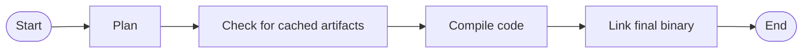
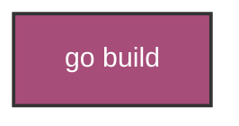
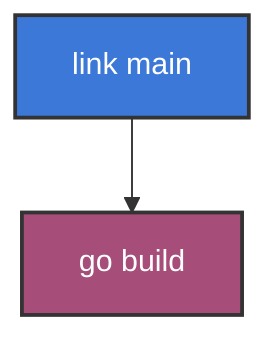
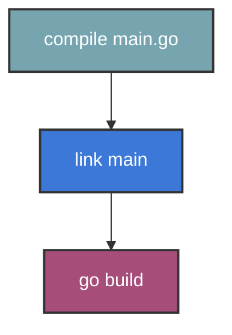
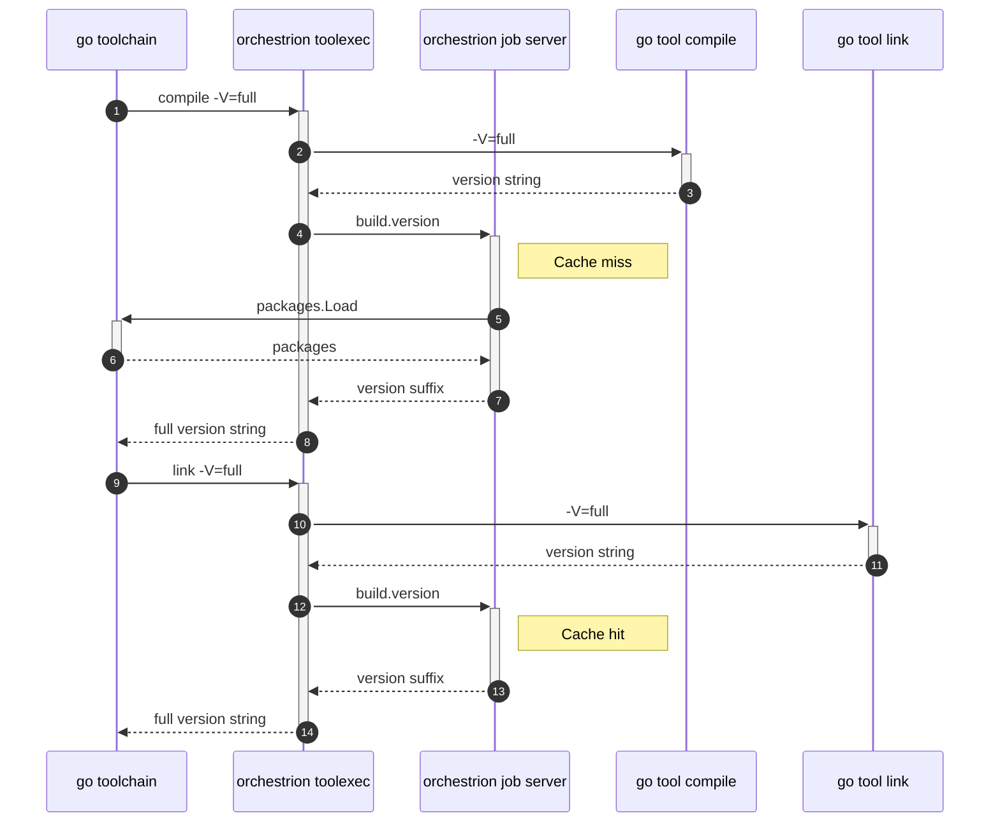
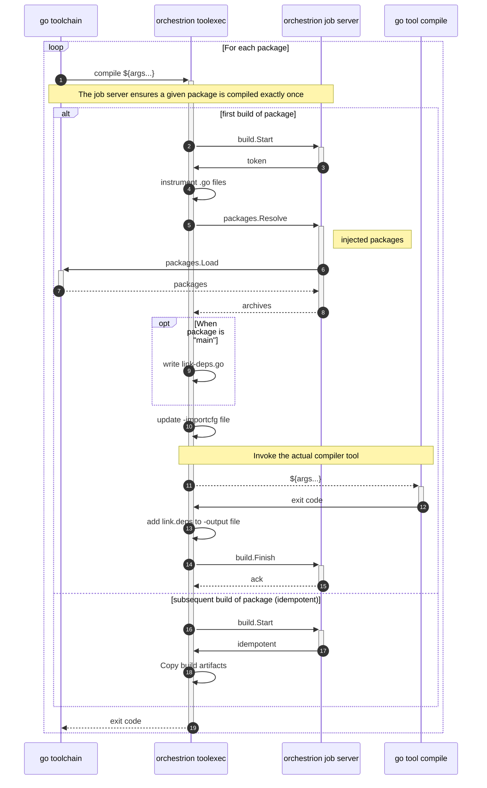
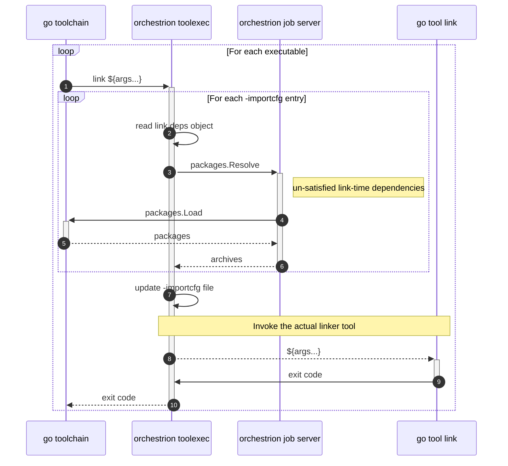

<!-- slide template="[[tpl-datadog-basic]]" -->

# `Unleashing the Go Toolchain`

GopherCon UK 2025

---

<!-- slide template="[[tpl-datadog-basic]]" -->

![[dd_logo_v_white.png|400]]

---

<!-- slide template="[[tpl-datadog-basic]]" -->

---

<!-- slide template="[[tpl-datadog-basic]]" -->

What makes Go great?

*No magic*

![[no_magic.png|300]]

---

<!-- slide template="[[tpl-datadog-basic-light]]" -->

What makes Go great?

- Code is easy to read
- Nothing is hidden
- Native binary

---

<!-- slide template="[[tpl-datadog-basic-light]]" -->

![[abelson_quote.png]]

---

<!-- slide template="[[tpl-datadog-basic]]" -->

# Why?

---

<!-- slide template="[[tpl-datadog-basic-light]]" -->

# The Developer Experience Gap

**Python Developers:**

```bash
opentelemetry-instrument python myapp.py
```

**Java Developers:**

```bash
java -javaagent:agent.jar myapp.jar
```

**Go Developers:**

```go
// Manually instrument every function... 😢
ctx, span := tracer.Start(ctx, "funcName")
defer span.End()
```

---

<!-- slide template="[[tpl-datadog-basic-light]]" -->

# The Pain is Real

**Manual instrumentation means:**

| | Challenge |
|---|---|
| ❌ | Writing boilerplate in every function |
| ❌ | Remembering to add spans for new code |
| ❌ | Inconsistent coverage across teams |
| ❌ | Maintenance burden when requirements change |

**What Go developers want:**

| | Goal |
|---|---|
| ✅ | The same zero-friction experience |

---

<!-- slide template="[[tpl-datadog-basic-light]]" -->

## The Three Pillars

**Logs** → What happened?

**Metrics** → How much and how fast?

**Traces** → Where did the time go?

---

<!-- slide template="[[tpl-datadog-basic-light]]" -->

## Two Approaches

**Manual Instrumentation**

| | Reality |
|---|---|
| ✅ | Complete control |
| ❌ | Developer overhead |
| ❌ | Inconsistent coverage |

---

<!-- slide template="[[tpl-datadog-basic-light]]" -->

**Automatic Instrumentation**

| | Benefits |
|---|---|
| ✅ | No code changes |
| ✅ | Consistent coverage |
| ❌ | Language-dependent magic |

---

<!-- slide template="[[tpl-datadog-basic-light]]" -->

# Logs

---

<!-- slide template="[[tpl-datadog-basic-light]]" -->

# Metrics

---

<!-- slide template="[[tpl-datadog-basic-light]]" -->

# Traces

---

<!-- slide template="[[tpl-datadog-basic-light]]" -->

```java
import io.opentelemetry.api;

public class MyClass {
 public static Tracer tracer =
        openTelemetry.getTracer(
         "instrumentation-library-name",
         "1.0.0"
        );

    public static void main(String[] args) {
        Span span = tracer.spanBuilder("my_span").startSpan();
        try (Scope ss = span.makeCurrent()) {
            // YOUR BUSINESS LOGIC GOES HERE
        } finally {
            span.end();
        }
    }
}
```

---

<!-- slide template="[[tpl-datadog-basic-light]]" -->

```js
const { trace } = require('@opentelemetry/api');
const tracer = trace.getTracer('instrumentation-library-name', '0.1.0');

function doSomething(data) {
 return tracer.startActiveSpan('my_span', (span) => {
      const result = [];

      // YOUR BUSINESS LOGIC GOES HERE

      span.end();
      return result;
  });
}
```

---

<!-- slide template="[[tpl-datadog-basic-light]]" -->

```go
var tracer trace.Tracer

func main() {
    ctx := context.Background()
    exp, _ := newExporter(ctx)

    // Create a new tracer provider with a
    // batch span processor and the given exporter.
    tp := newTraceProvider(exp)

    // Handle shutdown properly so nothing leaks.
    defer func() { _ = tp.Shutdown(ctx) }()

    otel.SetTracerProvider(tp)

    // Finally, set the tracer that can be used for this package.
    tracer = tp.Tracer("ExampleService")
}
```

---

<!-- slide template="[[tpl-datadog-basic-light]]" -->

```go
func httpHandler(w http.ResponseWriter, r *http.Request) {
    ctx, span := tracer.Start(r.Context(),"my_span")
    defer span.End()

    // YOUR BUSINESS LOGIC GOES HERE
}
```

---

<!-- slide template="[[tpl-datadog-basic-light]]" -->

```java
public class MyClass {

    @WithSpan
    public void myMethod() {
      // method code is unchanged
    }
}
```

---

<!-- slide template="[[tpl-datadog-basic-light]]" -->

![[mickey_the_wizard.png|500]]
Automagic Instrumentation

---

<!-- slide template="[[tpl-datadog-basic-light]]" -->

```shell
java -javaagent:path/to/opentelemetry-javaagent.jar \
     -Dotel.service.name=your-service-name -jar myapp.jar
```

---

<!-- slide template="[[tpl-datadog-basic-light]]" -->

```shell
env OTEL_TRACES_EXPORTER=otlp OTEL_EXPORTER_OTLP_TRACES_ENDPOINT=your-endpoint \
node --require @opentelemetry/auto-instrumentations-node/register app.js
```

---

<!-- slide template="[[tpl-datadog-basic-light]]" -->

```python
opentelemetry-instrument -—traces_exporter console,otlp \
    -—metrics_exporter console \
    --service_name your-service-name \
    --exporter_otlp_endpoint 0.0.0.0:4317 \
    python myapp.py
```

---

<!-- slide template="[[tpl-datadog-basic-light]]" -->

# The Go Solution

**What if Go developers could write this:**

```yaml
# aspects.yaml
aspects:
  - name: "tracing"
    target: "func.*Context"
    template: |
      ctx, span := tracer.Start(ctx, "{{.FuncName}}")
      defer span.End()
```

**And get automatic instrumentation?**

---

<!-- slide template="[[tpl-datadog-basic-light]]" -->

# AOP for Go

**Go's answer to annotations**

| Language | Approach |
|---|---|
| Java | `@Transactional` `@Traced` |
| Python | `@decorator` |
| Go | YAML aspects + toolchain |

```yaml
aspects:
  - name: "auth"
    target: "func.*Order.*"
    template: |
      if !auth.IsAuthorized(ctx, "{{.Permission}}") {
          return ErrUnauthorized
      }

  - name: "logging"
    target: "func.*"
    template: |
      log.InfoContext(ctx, "{{.FuncName}} started")
```

**Same zero-friction experience. Zero runtime magic.**

---

<!-- slide template="[[tpl-datadog-basic-light]]" -->

# Before vs After

**Manual Go (today):**

```go
func ProcessOrder(ctx context.Context, order Order) error {
    // 15 lines of instrumentation boilerplate
    ctx, span := tracer.Start(ctx, "ProcessOrder")
    defer span.End()

    if !auth.IsAuthorized(ctx, "orders:write") {
        return ErrUnauthorized
    }

    log.InfoContext(ctx, "processing order")
    // ... actual business logic buried somewhere
}
```

---

<!-- slide template="[[tpl-datadog-basic-light]]" -->

**YAML-Automated Go (future):**

```go
func ProcessOrder(ctx context.Context, order Order) error {
    // Just business logic!
    return processOrderInternal(ctx, order)
}
```

```yaml
# aspects.yaml - instrumentation lives here
aspects:
  - { name: "tracing", target: "func.*Context" }
  - { name: "auth", target: "func.*Order.*" }
  - { name: "logging", target: "func.*" }
```

---

<!-- slide template="[[tpl-datadog-basic-light]]" -->

# The Challenge

**Go's constraints:**

| | Reality |
|---|---|
| ❌ | No annotations |
| ❌ | No runtime code injection |
| ✅ | Must compile instrumentation into binary |

**But:** Go puts its magic in **tools**, not the language

---

<!-- slide template="[[tpl-datadog-basic-light]]" -->

No annotations

---

<!-- slide template="[[tpl-datadog-basic-light]]" -->

No way to insert code at runtime
(no magic)

---

<!-- slide template="[[tpl-datadog-basic-light]]" -->

You Must Compile Trace Code Into Your Go Program

---

<!-- slide template="[[tpl-datadog-basic-light]]" -->

Go Puts its Magic in Tools, not the Language

---

<!-- slide template="[[tpl-datadog-basic-light]]" -->

## The Challenge

How do we add instrumentation to Go code **without** manual changes?

---

<!-- slide template="[[tpl-datadog-basic-light]]" -->

## The Solution

**Intercept the build process**

- Hook into the Go toolchain
- Transform source code during compilation
- Generate instrumentation automatically

---

<!-- slide template="[[tpl-datadog-basic-light]]" -->

# Step 2: Enter `-toolexec`

**The key that unlocks YAML-driven instrumentation**

```yaml
aspects.yaml → toolexec wrapper → AST transformation → instrumented code
```

The hidden superpower of the Go toolchain

---

<!-- slide template="[[tpl-datadog-basic-light]]" -->

## The standard Go build process

Schematically, the standard toolchain's process for creating an executable (e.g,
to fulfill a `go build` command) is:



---

<!-- slide template="[[tpl-datadog-basic-light]]" -->

```text
-toolexec 'cmd args'
 a program to use to invoke toolchain programs like vet and asm.
 For example, instead of running asm, the go command will run
 'cmd args /path/to/asm <arguments for asm>'.
 The TOOLEXEC_IMPORTPATH environment variable will be set,
 matching 'go list -f {{.ImportPath}}' for the package being built.
```

---

<!-- slide template="[[tpl-datadog-basic-light]]" -->



notes:

^ when you tell go to build an executable, it's gonna break that task down into a bunch of smaller actions

---

<!-- slide template="[[tpl-datadog-basic-light]]" -->



notes:

^ first, go knows it'll need to spawn the linker to create an executable

---

<!-- slide template="[[tpl-datadog-basic-light]]" -->

```
link -o $WORK/b001/exe/a.out
    -importcfg $WORK/b001/importcfg.link
    -buildmode=pie -buildid=<...> -extld=clang
    $WORK/b001/_pkg_.a
```

---

<!-- slide template="[[tpl-datadog-basic-light]]" -->


notes:

^ it does this by subprocessesing the link tool

---

<!-- slide template="[[tpl-datadog-basic-light]]" -->

```
link -o $WORK/b001/exe/a.out
    -importcfg $WORK/b001/importcfg.link
    -buildmode=pie -buildid=<...> -extld=clang
    $WORK/b001/_pkg_.a
```


notes:

^ which takes the object file for main as an argument

---

<!-- slide template="[[tpl-datadog-basic-light]]" -->

```
link -o $WORK/b001/exe/a.out
    -importcfg $WORK/b001/importcfg.link
    -buildmode=pie -buildid=<...> -extld=clang
    $WORK/b001/_pkg_.a
```


notes:

^ and outputs out an executable.

^ but the linker also needs to know where to find object files for every other package in the build

^ and that comes from this importcfg.link file

---

<!-- slide template="[[tpl-datadog-basic-light]]" -->

```
link -o $WORK/b001/exe/a.out
    -importcfg $WORK/b001/importcfg.link
    -buildmode=pie -buildid=<...> -extld=clang
    $WORK/b001/_pkg_.a
```


notes:

^ and if we look inside this file,

---

<!-- slide template="[[tpl-datadog-basic-light]]" -->

```
link -o $WORK/b001/exe/a.out
    -importcfg $WORK/b001/importcfg.link
    -buildmode=pie -buildid=<...> -extld=clang
    $WORK/b001/_pkg_.a
```

```
packagefile ehden.net/fizzbuzz=$TMPDIR/go-build3163368752/b001/_pkg_.a
packagefile fmt=$TMPDIR/go-build3163368752/b002/_pkg_.a
packagefile log=$TMPDIR/go-build3163368752/b046/_pkg_.a
packagefile os=$TMPDIR/go-build3163368752/b035/_pkg_.a
packagefile strconv=$TMPDIR/go-build3163368752/b025/_pkg_.a
packagefile runtime=$TMPDIR/go-build3163368752/b009/_pkg_.a
...
```


notes:

^ ... we'll see a bunch of mappings from importpath to object file.

^ on go1.23, there are 47 packages in the build for our fizzbuzz program, and they're all gonna be listed in this file.

---

<!-- slide template="[[tpl-datadog-basic-light]]" -->


notes:

^ so continuing in reverse dependency order, the linker depends on all these object files existing, and those come from the compiler

---

<!-- slide template="[[tpl-datadog-basic-light]]" -->



notes:

^ so, go spawns the compiler

---

```
compile -o $WORK/b001/_pkg_.a
    -importcfg $WORK/b001/importcfg
    -trimpath "$WORK/b001=>"
    -p main -lang=go1.22 -complete -buildid <...>
    -goversion go1.22.5 -c=4 -shared -nolocalimports -pack
    ./fizzbuzz.go
```


notes:

^ the compiler takes a list of go files and spits out an object file, and there's another importcfg, but this importcfg *only contains direct dependencies of the package*

^ moving on, we also need all the packages that main depends on

---

<!-- slide template="[[tpl-datadog-basic-light]]" -->


notes:

^ so we're starting to see that this isn't a straight line, right? it's a graph

^ because main depends on fmt and log

^ but log also depends on fmt so that has to exist first, and so on.

^ this whole thing is called the action graph, but it's messy and i'm not gonna show all 47 packages like this so

---

<!-- slide template="[[tpl-datadog-basic-light]]" -->


notes:

^ i'm just gonna stick to this.

^ now that we know about the action graph, we can describe the behavior of the cover flag...

---

<!-- slide template="[[tpl-datadog-basic-light]]" -->

# Step 3: Practical Implementation

**From YAML aspects to working code**

*How we transform YAML definitions into AST modifications*

---

<!-- slide template="[[tpl-datadog-basic-light]]" -->

### Step 1: Simple Wrapper

```go
// toolexec-wrapper/main.go
package main

import (
 "fmt"
 "os"
 "os/exec"
)

func main() {
 tool := os.Args[1]
 args := os.Args[2:]

 // Log what we're intercepting
 fmt.Printf("TOOLEXEC: Running %s with %d args\n", tool, len(args))

 // Forward to original tool
 cmd := exec.Command(tool, args...)
 cmd.Stdout = os.Stdout
 cmd.Stderr = os.Stderr

 if err := cmd.Run(); err != nil {
  os.Exit(1)
 }
}
```

---

<!-- slide template="[[tpl-datadog-basic-light]]" -->

### Usage

```bash
go build -toolexec='./toolexec-wrapper' ./...
```

Output:

```
TOOLEXEC: Running compile with 15 args
TOOLEXEC: Running link with 8 args
```

---

<!-- slide template="[[tpl-datadog-basic-light]]" -->

### Step 2: Compiler Interception

```go
func main() {
 tool := os.Args[1]
 args := os.Args[2:]

 // Only intercept compile operations
 if strings.Contains(tool, "compile") {
  return handleCompile(tool, args)
 }

 // Pass through other tools
 return runTool(tool, args)
}
```

---

<!-- slide template="[[tpl-datadog-basic-light]]" -->

### Step 3: Source Code Analysis

```go
func handleCompile(tool string, args []string) error {
 // Find Go source files in args
 var goFiles []string
 for _, arg := range args {
  if strings.HasSuffix(arg, ".go") {
   goFiles = append(goFiles, arg)
  }
 }

 // Parse and analyze each Go file
 for _, file := range goFiles {
  if err := analyzeGoFile(file); err != nil {
   return err
  }
 }

 // Continue with compilation
 return runTool(tool, args)
}
```

---

<!-- slide template="[[tpl-datadog-basic-light]]" -->

### Step 4: AST Transformation

```go [1-3|5-8|10-15]
import (
 "go/ast"
 "go/parser"
 "go/token"
)

func analyzeGoFile(filename string) error {
 fset := token.NewFileSet()
 node, err := parser.ParseFile(fset, filename, nil, parser.ParseComments)
 if err != nil {
  return err
 }

 // Transform the AST
 ast.Inspect(node, func(n ast.Node) bool {
  if fn, ok := n.(*ast.FuncDecl); ok {
   instrumentFunction(fn)
  }
  return true
 })

 return nil
}
```

---

<!-- slide template="[[tpl-datadog-basic-light]]" -->

### Adding Instrumentation

```go [1-5|7-12|14-20]
func instrumentFunction(fn *ast.FuncDecl) {
 if fn.Name.Name == "main" {
  return // Skip main function
 }

 // Create span start statement
 spanStart := &ast.AssignStmt{
  Lhs: []ast.Expr{
   ast.NewIdent("_, span"),
  },
  Tok: token.DEFINE,
  Rhs: []ast.Expr{
   &ast.CallExpr{
    Fun: &ast.SelectorExpr{
     X:   ast.NewIdent("tracer"),
     Sel: ast.NewIdent("Start"),
    },
    Args: []ast.Expr{
     ast.NewIdent("ctx"),
     &ast.BasicLit{
      Kind:  token.STRING,
      Value: fmt.Sprintf("\"%s\"", fn.Name.Name),
     },
    },
   },
  },
 }

 // Add defer span.End()
 deferStmt := &ast.DeferStmt{
  Call: &ast.CallExpr{
   Fun: &ast.SelectorExpr{
    X:   ast.NewIdent("span"),
    Sel: ast.NewIdent("End"),
   },
  },
 }

 // Insert at beginning of function
 fn.Body.List = append([]ast.Stmt{spanStart, deferStmt}, fn.Body.List...)
}
```

---

<!-- slide template="[[tpl-datadog-basic-light]]" -->

# Aspect-Oriented Programming in Go

Cross-cutting concerns made simple

---

<!-- slide template="[[tpl-datadog-basic-light]]" -->

## Traditional AOP

**Java/C#**: Annotations and weaving
**JavaScript**: Proxies and decorators
**Python**: Decorators and metaclasses

**Go**: ?

---

<!-- slide template="[[tpl-datadog-basic-light]]" -->

## Go's AOP via toolexec

**Compile-time code transformation**

- No runtime overhead
- No reflection needed
- Zero cognitive load for developers

---

<!-- slide template="[[tpl-datadog-basic-light]]" -->

## Cross-Cutting Concerns

**Observability**

- Tracing, metrics, logging
- Error tracking
- Performance monitoring

**Security**

- Authentication checks
- Input validation
- Audit logging

**Reliability**

- Circuit breakers
- Retries with backoff
- Health checks

---

<!-- slide template="[[tpl-datadog-basic-light]]" -->

## Before: Manual Implementation

```go
func ProcessOrder(ctx context.Context, order Order) error {
    // Start tracing
    ctx, span := tracer.Start(ctx, "ProcessOrder")
    defer span.End()

    // Authentication
    if !auth.IsAuthorized(ctx, "orders:write") {
        span.SetStatus(codes.Error, "unauthorized")
        return ErrUnauthorized
    }

    // Logging
    log.InfoContext(ctx, "processing order", "orderID", order.ID)

    // Circuit breaker
    err := circuitBreaker.Execute(func() error {
        return processOrderInternal(ctx, order)
    })

    // Error handling
    if err != nil {
        span.SetStatus(codes.Error, err.Error())
        log.ErrorContext(ctx, "order processing failed", "error", err)
        metrics.Counter("orders.failed").Inc()
        return err
    }

    // Success metrics
    metrics.Counter("orders.processed").Inc()
    return nil
}
```

---

<!-- slide template="[[tpl-datadog-basic-light]]" -->

## After: Aspect-Oriented Go

```go
func ProcessOrder(ctx context.Context, order Order) error {
    return processOrderInternal(ctx, order)
}
```

**Generated automatically via toolexec**

---

<!-- slide template="[[tpl-datadog-basic-light]]" -->

## Aspect Definitions

```yaml
# aspects.yaml
aspects:
  - name: "tracing"
    target: "func.*Context"
    template: |
      ctx, span := tracer.Start(ctx, "{{.FuncName}}")
      defer span.End()

  - name: "auth"
    target: "func.*Order.*"
    template: |
      if !auth.IsAuthorized(ctx, "{{.Permission}}") {
          return ErrUnauthorized
      }

  - name: "logging"
    target: "func.*"
    template: |
      log.InfoContext(ctx, "{{.FuncName}} started")
      defer log.InfoContext(ctx, "{{.FuncName}} completed")
```

---

<!-- slide template="[[tpl-datadog-basic-light]]" -->

# Production Validation: Orchestrion

**The YAML vision, realized in production**

Datadog's proof that this approach works at scale

![[orchestrion.png|400]]

*"If YAML + toolexec can work, this is how"*

---

<!-- slide template="[[tpl-datadog-basic-light]]" -->

## What is Orchestrion?

**Compile-time auto-instrumentation for Go applications**

- Zero code changes required
- OpenTelemetry-compatible tracing
- Supports major Go frameworks and libraries
- Production-ready with performance optimizations

---

<!-- slide template="[[tpl-datadog-basic-light]]" -->

## How it Works

```bash
# Install Orchestrion
go install github.com/DataDog/orchestrion@latest

# Instrument your application
orchestrion go build -o myapp ./...

# Or use it directly with go build
go build -toolexec="orchestrion toolexec" -o myapp ./...
```

---

<!-- slide template="[[tpl-datadog-basic-light]]" -->

### Toolchain Versions



---

<!-- slide template="[[tpl-datadog-basic-light]]" -->

### Compilation



---

<!-- slide template="[[tpl-datadog-basic-light]]" -->

### Link



---

<!-- slide template="[[tpl-datadog-basic-light]]" -->

---

<!-- slide template="[[tpl-datadog-basic-light]]" -->

---

<!-- slide template="[[tpl-datadog-basic-light]]" -->

## Before: Manual Instrumentation

```go
func handleOrder(w http.ResponseWriter, r *http.Request) {
    // Manual tracing setup
    tracer := otel.Tracer("order-service")
    ctx, span := tracer.Start(r.Context(), "handleOrder")
    defer span.End()

    // Manual database instrumentation
    db := sqlx.NewDb(sql.Open("postgres", dsn))
    ctx, dbSpan := tracer.Start(ctx, "db.query")
    defer dbSpan.End()

    var order Order
    err := db.GetContext(ctx, &order, "SELECT * FROM orders WHERE id = $1", orderID)
    if err != nil {
        dbSpan.SetStatus(codes.Error, err.Error())
        span.SetStatus(codes.Error, err.Error())
        http.Error(w, err.Error(), 500)
        return
    }

    // Manual HTTP client instrumentation
    client := &http.Client{}
    req, _ := http.NewRequestWithContext(ctx, "POST", paymentURL, nil)
    ctx, httpSpan := tracer.Start(ctx, "http.client")
    defer httpSpan.End()

    resp, err := client.Do(req)
    // ... more manual instrumentation
}
```

---

<!-- slide template="[[tpl-datadog-basic-light]]" -->

## After: Orchestrion Magic

```go
func handleOrder(w http.ResponseWriter, r *http.Request) {
    // Get order from database
    var order Order
    err := db.GetContext(r.Context(), &order, "SELECT * FROM orders WHERE id = $1", orderID)
    if err != nil {
        http.Error(w, err.Error(), 500)
        return
    }

    // Call payment service
    client := &http.Client{}
    req, _ := http.NewRequestWithContext(r.Context(), "POST", paymentURL, nil)
    resp, err := client.Do(req)

    // Business logic only!
}
```

**Orchestrion automatically adds tracing to:**

- HTTP handlers and clients
- Database operations
- gRPC calls
- Redis operations
- And more...

---

<!-- slide template="[[tpl-datadog-basic-light]]" -->

## Supported Integrations

**HTTP**

- `net/http` (handlers, clients)
- `gorilla/mux`
- `gin-gonic/gin`
- `labstack/echo`

**Databases**

- `database/sql`
- `jmoiron/sqlx`
- `go-gorm/gorm`
- `go-redis/redis`

**RPC**

- `google.golang.org/grpc`
- Standard `net/rpc`

**And many more...**

---

<!-- slide template="[[tpl-datadog-basic-light]]" -->

## Architecture Deep Dive

```
┌─────────────────┐    ┌──────────────────┐    ┌─────────────────┐
│   Go Source     │───▶│   Orchestrion    │───▶│ Instrumented    │
│     Code        │    │   toolexec       │    │   Go Code       │
└─────────────────┘    └──────────────────┘    └─────────────────┘
                                │
                                ▼
                       ┌──────────────────┐
                       │  AST Transform   │
                       │  + Code Injection│
                       └──────────────────┘
```

1. **Intercept**: Hook into Go compilation via `-toolexec`
2. **Analyze**: Parse AST to identify instrumentation points
3. **Transform**: Inject OpenTelemetry calls
4. **Compile**: Forward to standard Go compiler

---

<!-- slide template="[[tpl-datadog-basic-light]]" -->

## Performance Impact

**Compile Time**: +10-20% (one-time cost)
**Runtime Overhead**: <1% CPU, <50MB memory
**Binary Size**: +5-10MB (OpenTelemetry deps)

**But you get:**

- Automatic distributed tracing
- Zero maintenance overhead
- Consistent instrumentation across team
- Production-ready observability

---

<!-- slide template="[[tpl-datadog-basic-light]]" -->

# The Growing Ecosystem

**The vision is spreading**

| Project | Approach | Status |
|---|---|---|
| Orchestrion | Production-ready instrumentation | ✅ Shipping |
| SkyWalking Go | Apache's take on compile-time tracing | ✅ Active |
| xgo | Monkey patching via toolexec | ✅ Mature |
| go-instrument | Generic framework | 🔄 Emerging |

**What's Next:** YAML-driven toolexec becoming the standard pattern

---

<!-- slide template="[[tpl-datadog-basic-light]]" -->

# Best Practices & Considerations

**Performance Considerations**

- Compilation time increases 10-20%
- Binary size grows with instrumentation code
- Runtime overhead should be <1% CPU

**Reliability Guidelines**

- Always preserve original tool exit codes
- Handle edge cases and malformed input gracefully
- Test with real-world codebases before deployment

---

<!-- slide template="[[tpl-datadog-basic-light]]" -->

# Key Takeaways

**toolexec unlocks Go's hidden potential**

1. **Compile-time transformation** beats runtime magic
2. **Zero developer friction** for maximum adoption
3. **Ecosystem growth** through shared toolexec patterns
4. **Production-ready solutions** already exist

---

<!-- slide template="[[tpl-datadog-basic-light]]" -->

# Go's Unique Approach

**Other Languages**: Runtime magic, annotations, proxies

**Go**: Compile-time transformation via toolchain

- **Predictable**: What you see is what you get
- **Performant**: No runtime reflection overhead
- **Powerful**: Full AST access and manipulation
- **Practical**: Works with existing build systems

---

<!-- slide template="[[tpl-datadog-basic-light]]" -->

# The Future

**Growing Ecosystem**

- More toolexec-based tools emerging
- Standard patterns for common use cases
- Integration with CI/CD pipelines
- Team adoption strategies

**What's Next?**

- Experiment with simple wrappers
- Explore AST transformation
- Consider Orchestrion for production
- Build your own toolexec solutions

---

<!-- slide template="[[tpl-datadog-basic-light]]" -->

---

<!-- slide template="[[tpl-datadog-basic-light]]" -->

# Thanks

---

Resources:

- [[Proposal]]
- [[Links]]
- <https://en.wikipedia.org/wiki/Aspect-oriented_programming>
- <https://datadoghq.dev/orchestrion/docs/>
- <https://datadoghq.dev/orchestrion/contributing/aspects/>

Tooling:

- <https://mszturc.github.io/obsidian-advanced-slides/basic-syntax/tables/>
